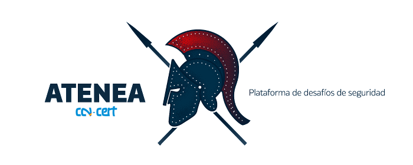

# ATENEA

**ATENEA** is a cyber security platform that presents a number of challenges which cover a wide array of topics: **Cryptography and Steganography , Exploiting, Forensics , Networking and Reversing** , etc.

ATENEA has been developed by the CCN-CERT, the Computer Emergency Response Team of the National Cryptologic Centre, CCN, under Spain’s National Intelligence Centre, CNI. This service was created in 2006 as the Spanish Government’s CERT.

The challenges are aimed at anyone interested in cybersecurity. The main goals are as follows:

* Raising awareness among IT personnel about cybersecurity risks.
* Engaging those experienced in IT security.
* Proving to those who are less skilled at IT security that these challenges can be fun and that cybersecurity is not a secret science that they will never understand.
