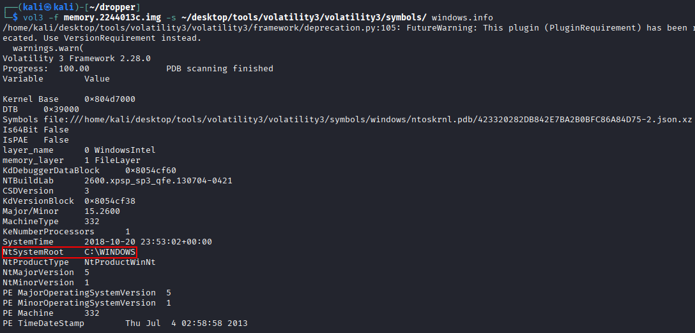
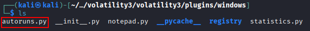

# dropper

## Overview

We suspect that the provided memory dump corresponds to a machine that has been persistently infected by some type of malware, possibly a dropper. We would like to identify the malicious domain used by it.

## Objective

- Investigate and determine the infection method and the malicious domain.
- Perform advanced investigations using specific plugins to process operating system–specific artifacts.

## Required Resources

- Volatility  
- Volatility plugins  
- Download the `.img` [here](https://drive.usercontent.google.com/download?id=1OgjS9MtPklkL-jeiZcoj9SLAs8mFcl41&export=download&authuser=1)

## Solution

After downloading the file, we run the following command to identify the operating system. The output shows that it is Windows:

```bash
vol3 -f memory.2244013c.img -s ~/desktop/tools/volatility3/volatility3/symbols/ banners.Banners 
```


We can extract a bit more system information with the following command:

```bash
vol3 -f memory.2244013c.img -s ~/desktop/tools/volatility3/volatility3/symbols/ windows.info
```




Since we were told the infection is persistent, we look for scheduled tasks. For that, I copy this [script](https://github.com/tomchop/volatility3-autoruns/blob/main/autoruns.py) to the clipboard. Paste it into the Volatility plugins path.



Then we run the following command to execute the script. After the analysis, we can see that on a regular interval it visits http://wiki-read.com/info.txt and executes its contents.

```bash
vol3 -f memory.2244013c.img -s ~/desktop/tools/volatility3/volatility3/symbols/ windows.autoruns
```


