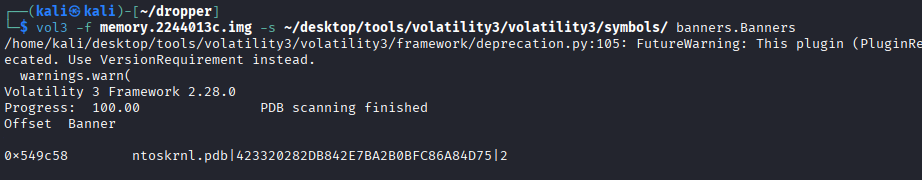
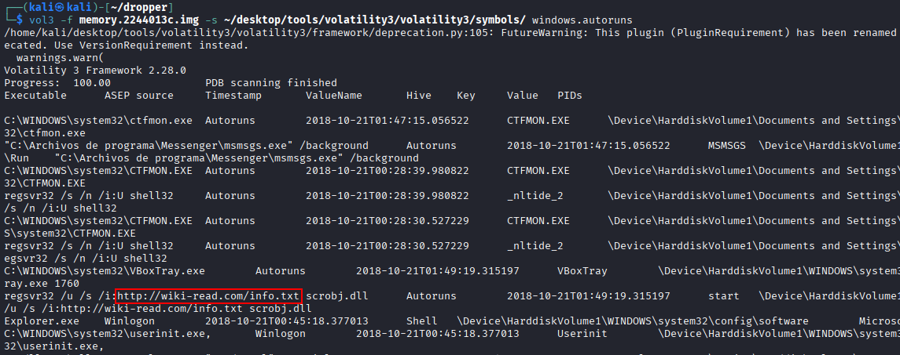

# dropper

##
We suspect that the provided memory dump corresponds to a machine that has been persistently infected by some type of malware, possibly a dropper. We would like to identify the malicious domain used by it.

### Objectives
- Investigate and determine the infection method and the malicious domain.
- Perform advanced investigations using specific plugins to process operating system–specific artifacts.

### Required Resources
- Volatility  
- Volatility plugins  
- Download the practice [here](https://drive.usercontent.google.com/download?id=1OgjS9MtPklkL-jeiZcoj9SLAs8mFcl41&export=download&authuser=1)

vol3 -f memory.2244013c.img -s ~/desktop/tools/volatility3/volatility3/symbols/ banners.Banners 

vol3 -f memory.2244013c.img -s ~/desktop/tools/volatility3/volatility3/symbols/ windows.info

como nos han dicho que es un virus persistente, vamos a busar las tareas programadas. Para ellos, copio a l protapapeles este script

https://github.com/tomchop/volatility3-autoruns/blob/main/autoruns.py

lo peagamos en la ruta de plugins de volatility

vol3 -f memory.2244013c.img -s ~/desktop/tools/volatility3/volatility3/symbols/ windows.autoruns

en la imagen se puede ver que cada cierto tiempo, visita http://wiki-read.com/info.txt y ejecuta su contenido

