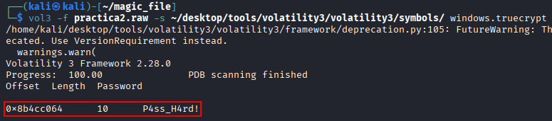
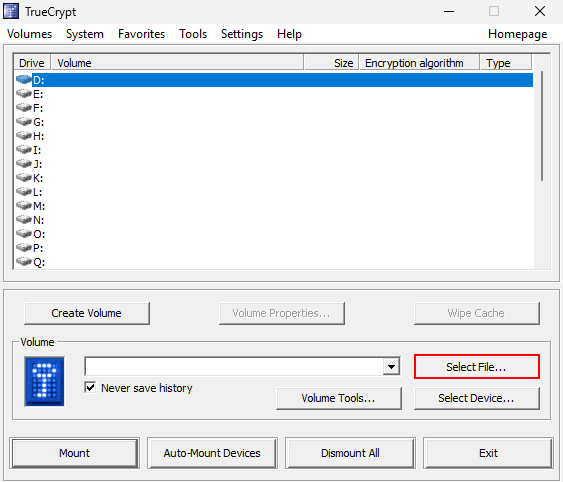
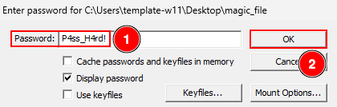

# magic_file

## Overview
The police have detained a suspect, and the powered-on computer has been seized as evidence. A RAM capture and a non-volatile memory analysis have been performed. During the analysis, a strange file was found, and its nature is unknown.

## Objective
- Investigate and determine the contents of this file.

## Required Resources
- Volatility
- Download the practice [here](https://drive.usercontent.google.com/download?id=1J_OfVL5IzVE44t5fergJA146wnbDSHA6&export=download&authuser=1)

vol3 -f practica2.raw -s ~/desktop/tools/volatility3/volatility3/symbols/ windows.pslist

podemos ver un porgama de cifrado que está activo y que por o tantop puede tener las claves de cirfrado en la memoreriua RAM

vol3 -f practica2.raw -s ~/desktop/tools/volatility3/volatility3/symbols/ windows.truecrypt

después de ejecutar este comadno podemos sacar la contraseña, que es XXX

en windwos, nos descargamos TrueCrypt de https://www.truecrypt.org/downloads y abrimos el archiov mágico que venía al descromprimir el [archivo](https://drive.usercontent.google.com/download?id=1J_OfVL5IzVE44t5fergJA146wnbDSHA6&export=download&authuser=1)

ahora se ha montado en D:

