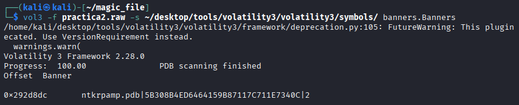
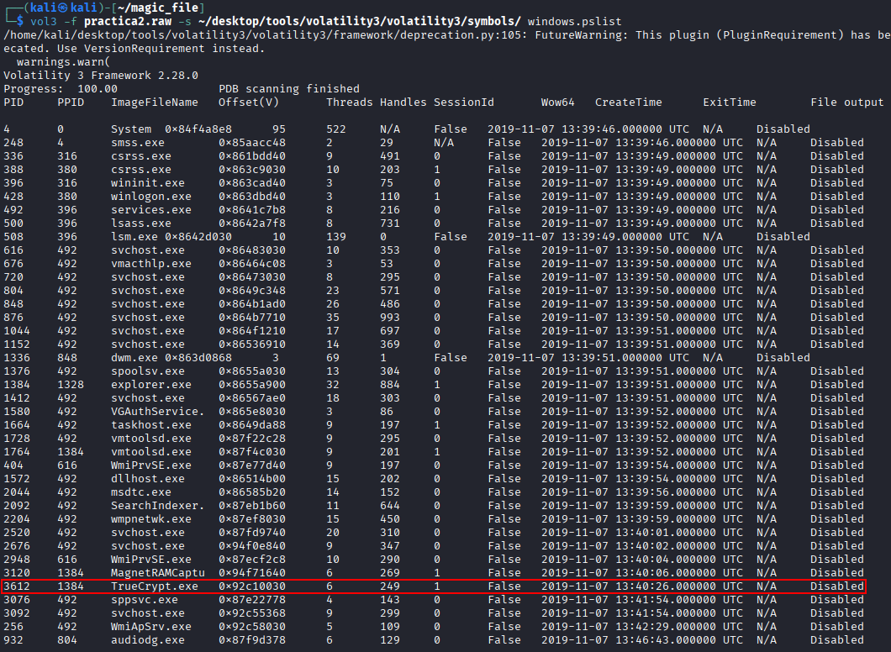
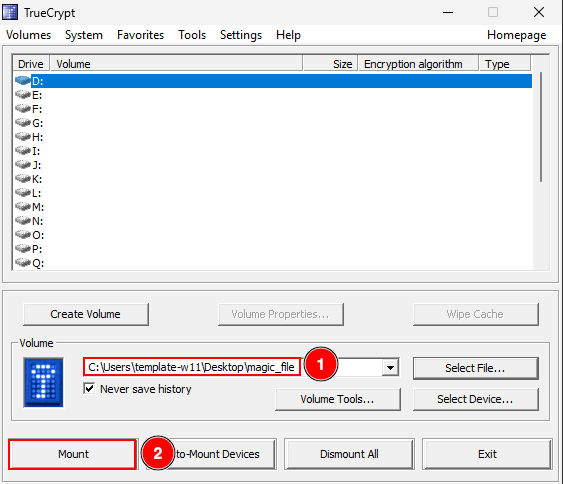
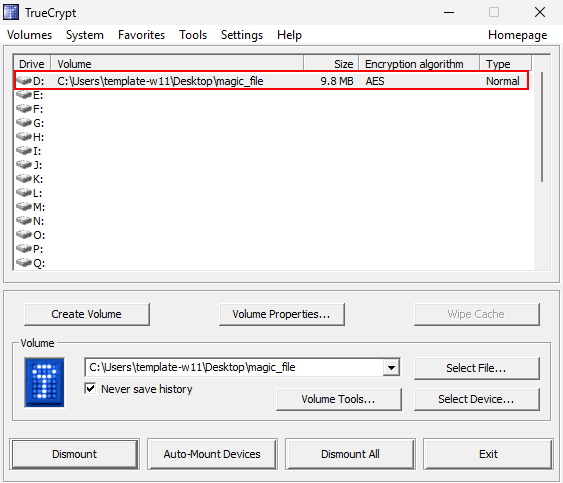
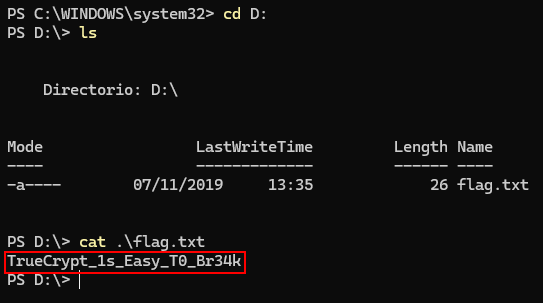

# magic_file

## Overview

The police have detained a suspect, and the powered-on computer has been seized as evidence. A RAM capture and a non-volatile memory analysis have been performed. During the analysis, a strange file was found, and its nature is unknown.

## Objective

- Investigate and determine the contents of this file.

## Required Resources

- Volatility  
- Download the `.raw` [here](https://drive.usercontent.google.com/download?id=1J_OfVL5IzVE44t5fergJA146wnbDSHA6&export=download&authuser=1)

## Solution

After downloading the memory dump, we identify the operating system with the following command. The output shows that it is Windows:

```bash
vol3 -f practica2.raw -s ~/desktop/tools/volatility3/volatility3/symbols/ banners.Banners
```



The `magic_file` is encrypted. After listing running processes, we see that TrueCrypt is loaded in memory, which suggests the volume password may also be present:

```bash
vol3 -f practica2.raw -s ~/desktop/tools/volatility3/volatility3/symbols/ windows.pslist
```



We can recover TrueCrypt-related secrets from memory with the dedicated plugin. In this case, the password is found:

```bash
vol3 -f practica2.raw -s ~/desktop/tools/volatility3/volatility3/symbols/ windows.truecrypt
```


On Windows, install [TrueCrypt](https://www.truecrypt.org/downloads) and open the encrypted container from the [provided archive](https://drive.usercontent.google.com/download?id=1J_OfVL5IzVE44t5fergJA146wnbDSHA6&export=download&authuser=1) (the `magic_file` inside it).

Following the steps below, we mount the volume with the recovered password and read its contents:








