# Android UnCrackable Level 1


The crack will be performed on a Kali Linux machine.

The installation process for each tool will not be shown, but every step to create the environment will be documented.

To install the `.apk`, an emulator is required. Create an emulator using the following command:

```bash
avdmanager create avd -n Android26 -k "system-images;android-26;default;x86_64" -c 10M
```

Verify that the device has been installed correctly:

```bash
avdmanager list avd
```

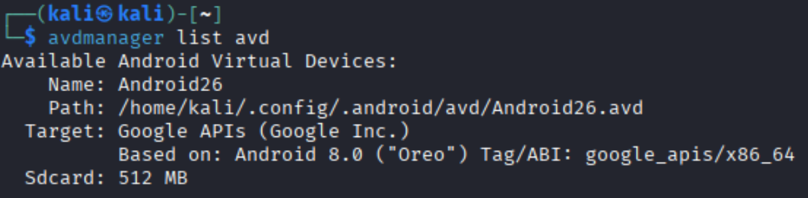

Start the emulator as follows:

```bash
emulator -avd Android26
```

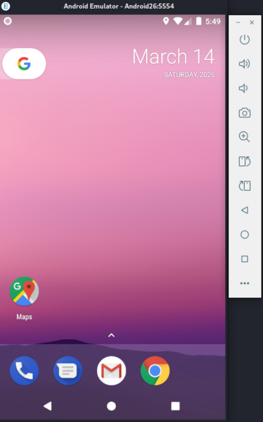

Use the following command to list connected devices. Note the device name.

```bash
adb devices
```

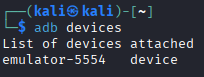

Download [UnCrackable-Level1.apk](https://github.com/OWASP/mastg/raw/master/Crackmes/Android/Level_01/UnCrackable-Level1.apk) and install it on the emulator. Then open the app.

```bash
adb -s emulator-5554 install UnCrackable-Level1.apk
```

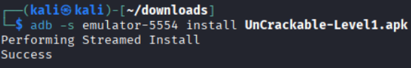

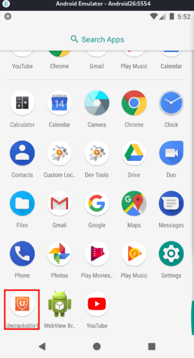

The application detects that the device is rooted and immediately closes.

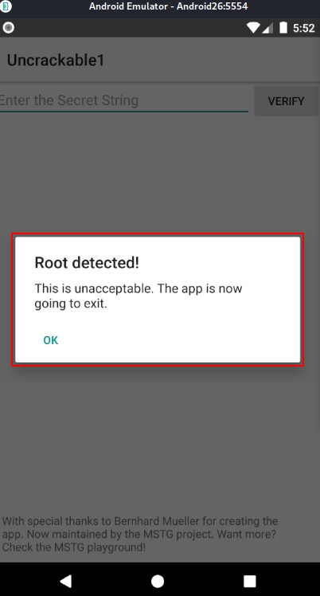

To bypass this, we need to investigate the app to find the anti-root check.

Android APK Studio will be used for static analysis, although other tools like `jadx` or `apktool` can do the same job.

Open Android APK Studio and click "File" -> "Open" -> "APK", then select `UnCrackable-Level1.apk`.

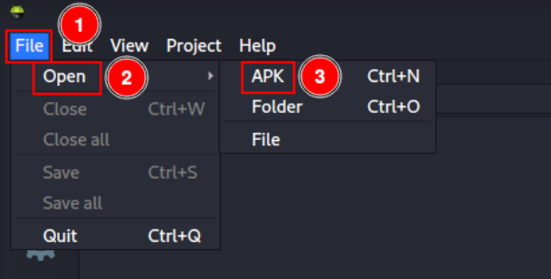

Select the "Decompile java?" checkbox and click "Decompile".

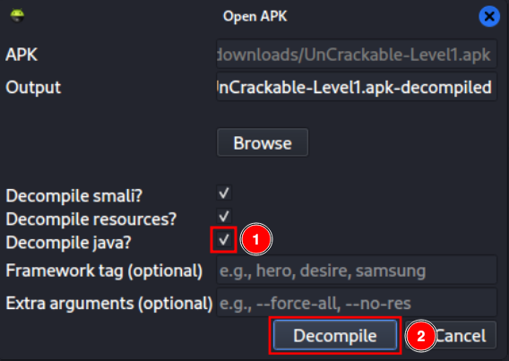

I will modify the app to bypass the root detection. Add the attribute `android:debuggable="true"` in `AndroidManifest.xml` to allow debugging.

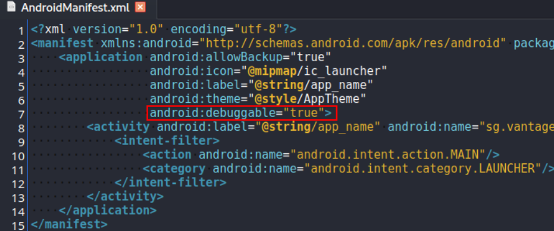

Navigate to the `MainActivity.java` file, which is the app's entry point, and analyze it.

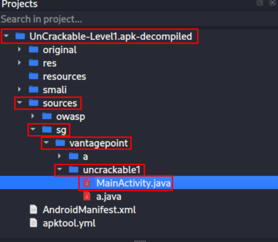

As shown, a function is triggered when `c.a()`, `c.b()`, or `c.c()` return true. In that case, the app detects root.

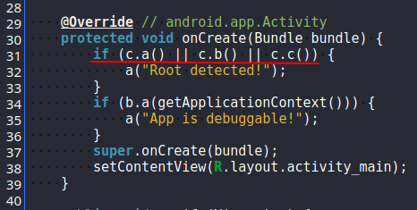

Open class `c` to study the anti-root protection.

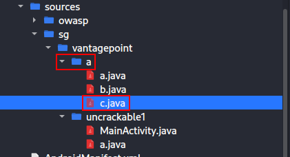

There we can see:

- `a`: detects `su` in the system path.
- `b`: searches for keys containing `test-keys`.
- `c`: searches for programs typically found in emulator environments.

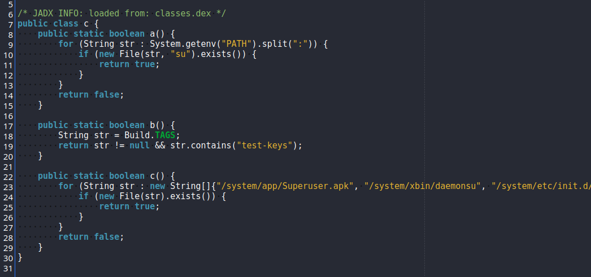

Back in `MainActivity.java`, after root is detected, the function `a` is called. That function displays a message and exits the application. This is exactly what we want to remove.

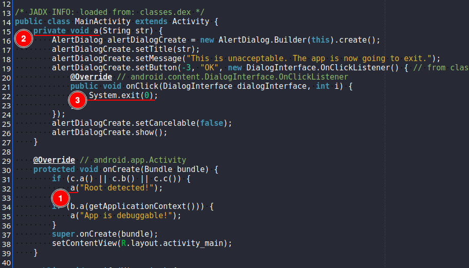

Open the `.smali` file that contains the exit function. In this case it is `MainActivity$1.smali`.

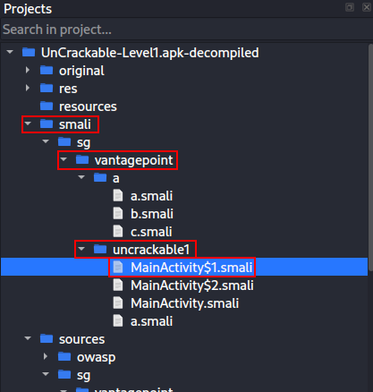

Analyzing the code, we can see a call to `System.exit`. Comment out this line to prevent the application from closing after root is detected.

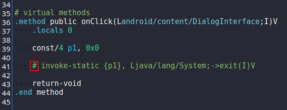

In the bottom-left corner, click the hammer icon to build the project.

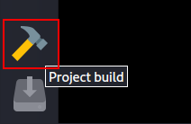

Type `--force` and click "OK".

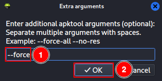

Then click "Project" -> "Sign / export".

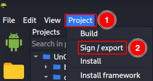

A key is required to sign the APK. Create a new key pair by clicking "Generate".

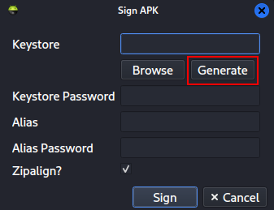

Enter the following information and click "Generate":

- Keystore Path: `debug.keystore`.
- Keystore Password: `android`.
- Alias: `androiddebugkey`.
- Alias Password: `android`.

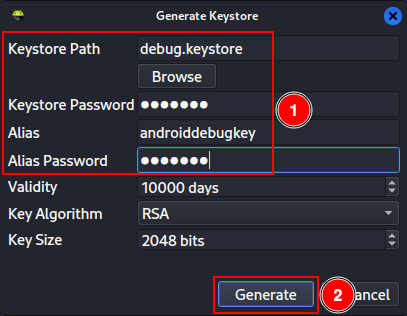

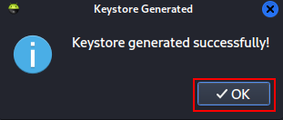

After the keys are generated, click "Sign".

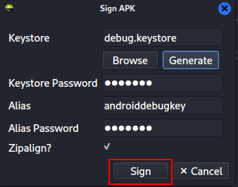

Check the console at the bottom to ensure the process completed successfully with exit code 0.

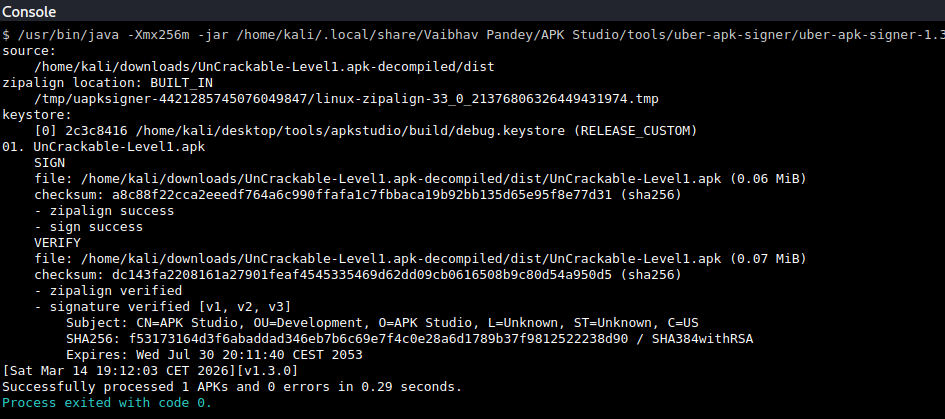

If you try to install the recompiled app now, you may see an error because the signature differs from the original.

```bash
adb -s emulator-5554 install UnCrackable-Level1.apk
```

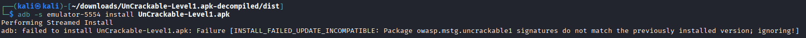

To avoid this, uninstall the original app and then install the modified one.

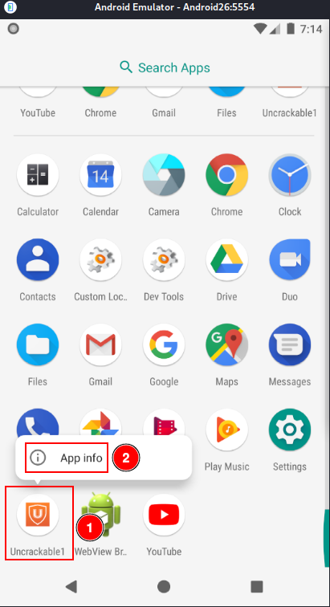

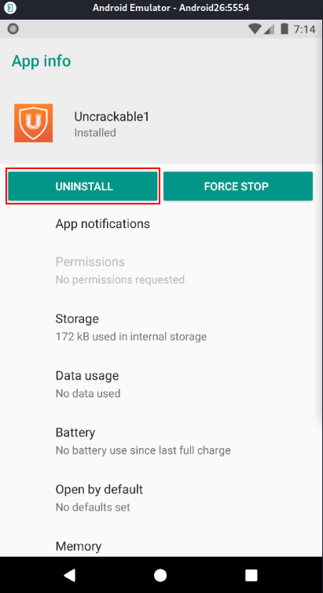

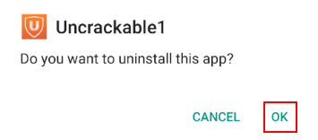

```bash
adb -s emulator-5554 install UnCrackable-Level1.apk
```

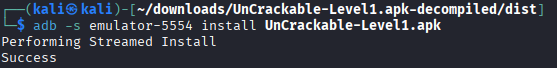

Open the app and observe that several error messages appear, but the application no longer exits due to the changes made.

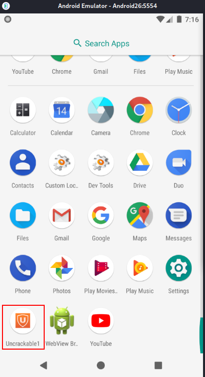

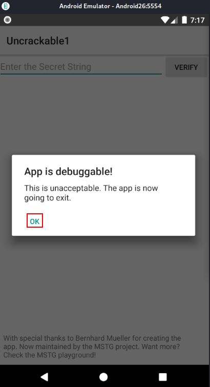

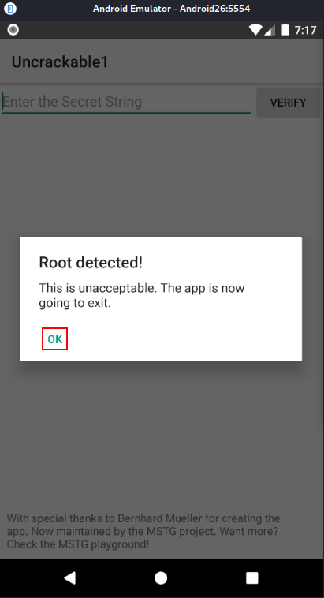

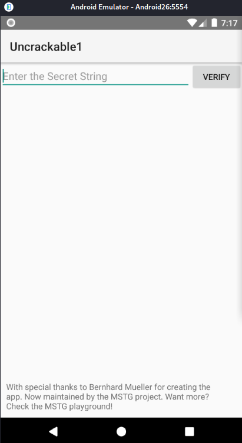

There is a form requesting a secret string. Try using "secret" and click "Verify" to see what happens.

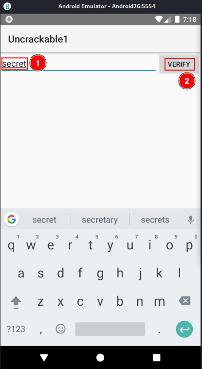

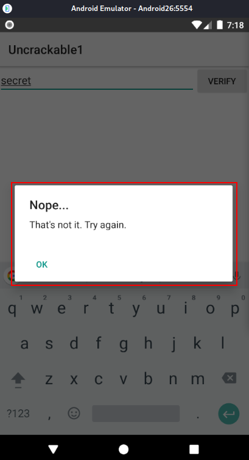

A deeper analysis of the code is required to understand what secret is expected and how to obtain it.

Return to `MainActivity.java` in APK Studio and check that `a.a` is validating our secret.

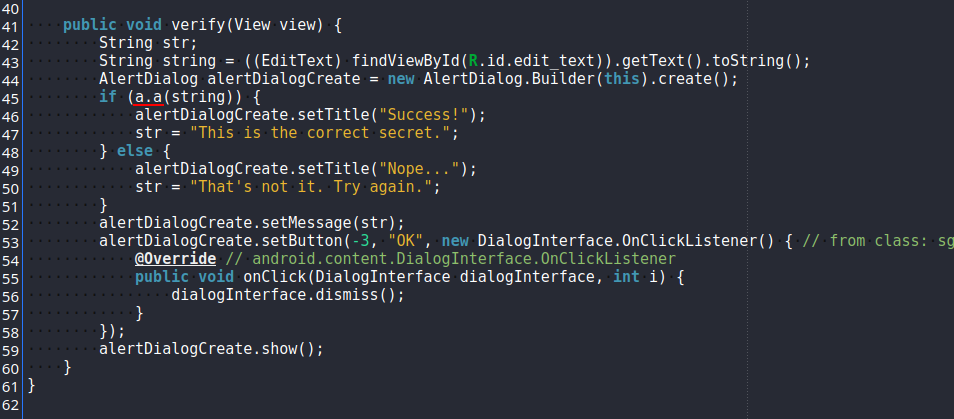

This function is located in the same folder as `MainActivity.java`.

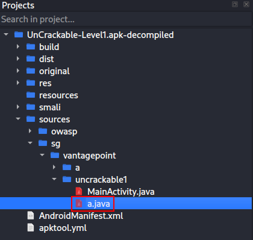

The function uses a hexadecimal key and a Base64 string to verify the secret with AES. The secret is not in plain text, but we have both the Base64 string and the AES decryption key.

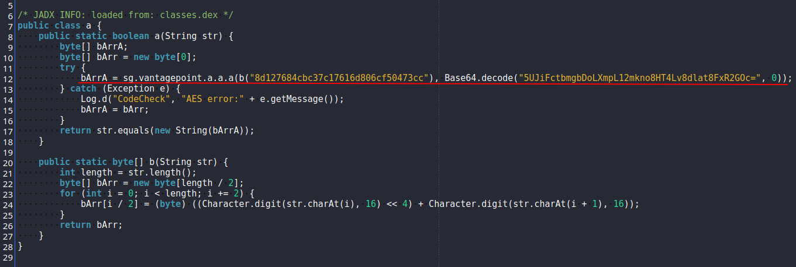

Open CyberChef (https://cyberchef.org), paste the Base64 string, decode it from Base64, and then decrypt it with AES using the hexadecimal key. The secret will be revealed.

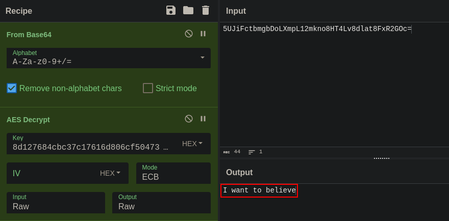

Enter the secret into the app and verify.

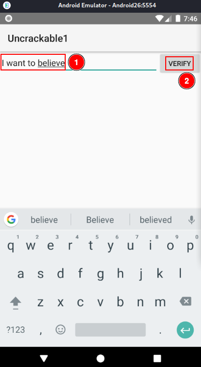

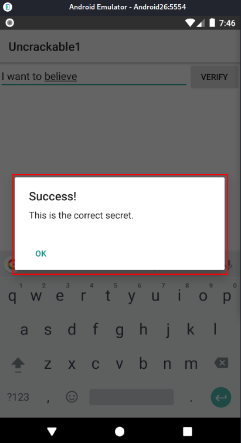