# Android UnCrackeable Level 3


The crack will be performed on a Kali Linux machine.

The installation process for each tool will not be shown, but every step to create the environment will be documented.

To install the `.apk` an emulator is required. Create an emulator using the following command:

```bash
avdmanager create avd -n Android26 -k "system-images;android-26;default;x86_64" -c 10M
```

Verify that the device has been installed correctly:

```bash
avdmanager list avd
```

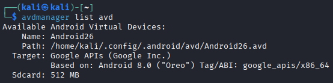

Start the emulator as follows:

```bash
emulator -avd Android26
```

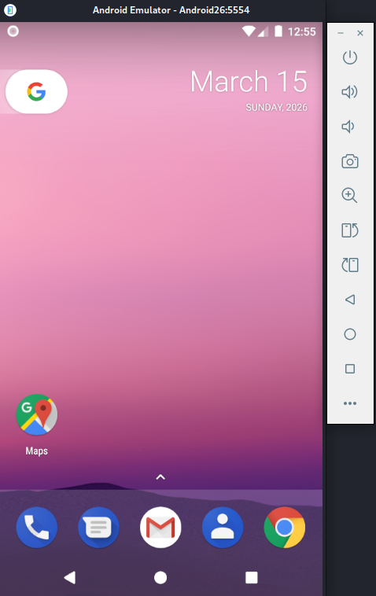

Use the following command to list connected devices. Note the device name.

```bash
adb devices
```

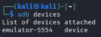

Download [UnCrackable-Level3.apk](https://github.com/OWASP/mastg/raw/master/Crackmes/Android/Level_03/UnCrackable-Level3.apk) and install it on the emulator. Then open the app.

```bash
adb -s emulator-5554 install UnCrackable-Level3.apk
```

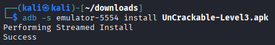

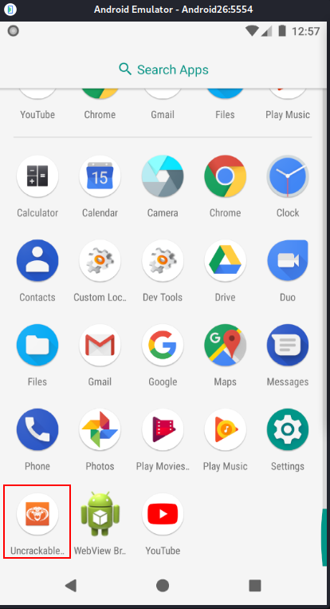

The application detects that the device is rooted and immediately closes.

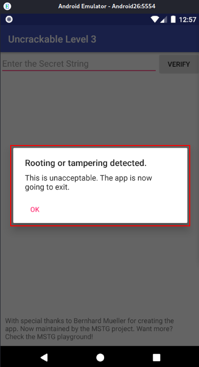

To bypass this, we need to investigate the app for an anti-root check. Android APK Studio will be used for static analysis, although other tools like `jadx` or `apktool` can do the same job.

Open Android APK Studio and click "File" -> "Open" -> "APK", then select UnCrackable-Level2.apk.


Select the "Decompile java?" checkbox and click "Decompile".

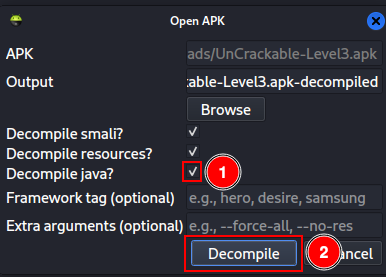

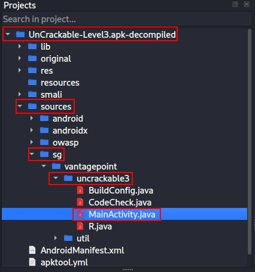

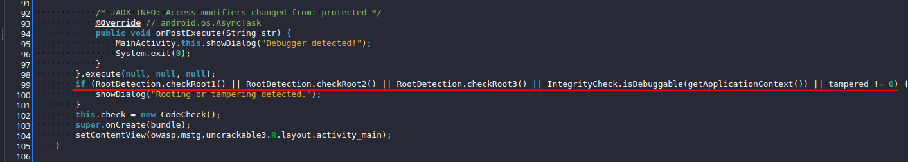

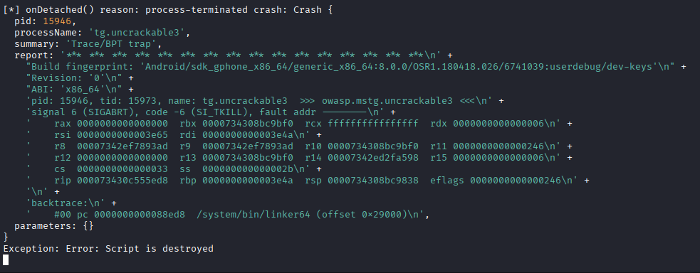

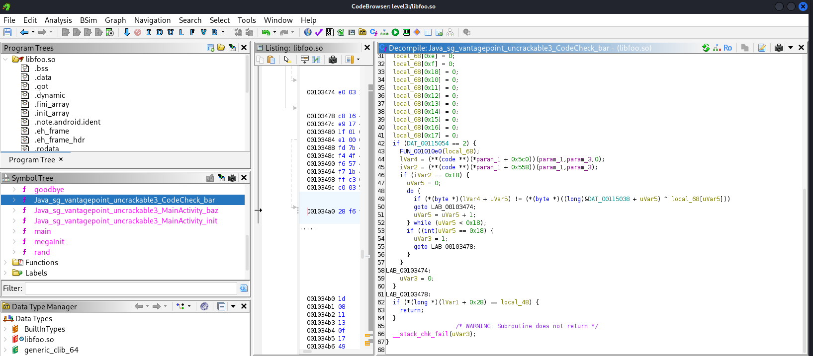

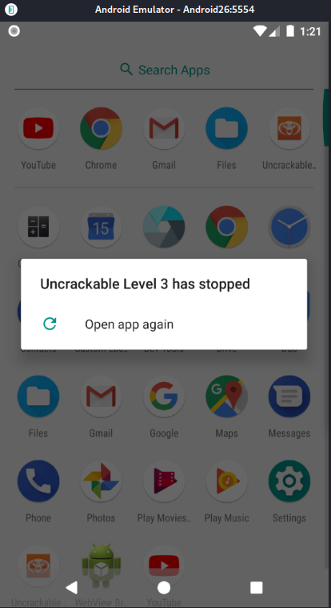